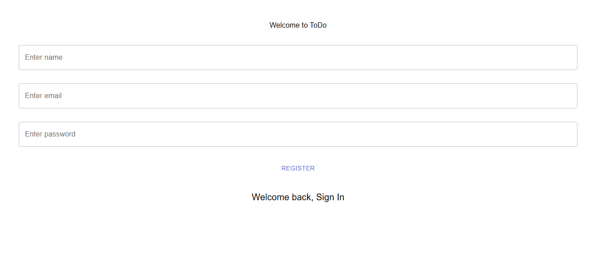
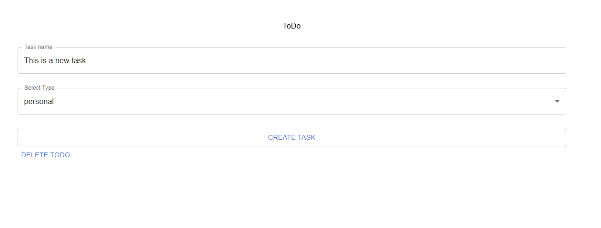
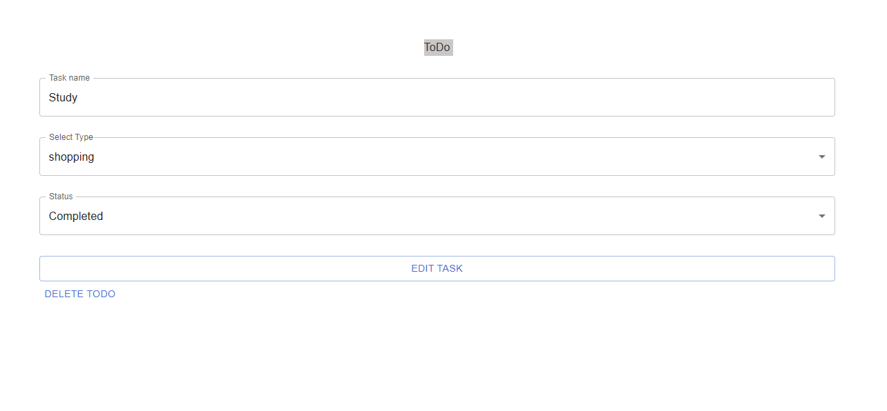
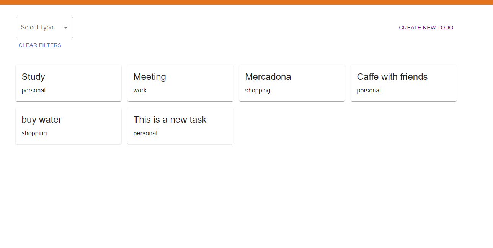

# CRUD TODO list Frontend
Este es el proyecto de frontend de la aplicación CDUR Todo List, en el cual se ha puesto principal atención al desarrollo del backend. Se ha utilizado la herramienta ```npx create-react-app``` para facilitar la creación de la aplicación en React.

## Inicio

Para comenzar a utilizar el proyecto de frontend de CDUR Todo List, sigue los siguientes pasos:

1. Clona o descarga el proyecto desde el repositorio en GitHub.
2. Abre la terminal y navega a la carpeta del proyecto.
3. Abre la branch **git checkout develop-new**
4. Ejecuta el siguiente comando para instalar todas las dependencias necesarias:
```
npm install
```
5. EDespués de que se instalen todas las dependencias, ejecuta el siguiente comando para iniciar la aplicación:
```
npm start
```
6. Crea un archivo **.env** y añada dentro los sigientes variables del entorno:
```
REACT_APP_SERVER_URL={REACT_APP_SERVER_URL}
```
Tambien puedes mirar el archivo **.env.example**. 

! Ten en cuenta que tienes que usar lo mismo URL que de **Backend** !

7. La aplicación se abrirá automáticamente en tu navegador en la dirección http://localhost:3000/. Si todo ha ido bien, deberías ver la página de inicio de sesión.


## Librerias
Para realizar el Frontend de applicacion he utizilazo un tutorial y librerias de React:

- axios: para realizar peticiones HTTP, 
- @mui: para la creación de componentes y estilos, 
- formik: para la gestión de formularios,
- yup, para la validación de datos,
- redux, para la gestión del estado de la aplicación.

Esa combinacion de librerias no es sencilla y no creo que volvere a usalo en este formato. Ademas una de las cosas que me qustaria cambiar es **quitar @mui y instalar SASS**. Creo que asi el codigo sera mas legible 

## Acceso

El proyecto cuenta con dos páginas de acceso: una para iniciar sesión y otra para registrar un nuevo usuario. Para acceder al contenido, es necesario estar registrado. 

**!!! La funcionalidad de registar un nuevo usuario esta en revicion y no disponible !!!**

Para aceder hay que añadir un usuario a su database con **credenciales de acceso**:
*Email*: test@gmail.com
*Contraseña*: 123456

## Funcionalidad: 

* Autenticación: 
   - Registro de nuevo usuario (en revision)
   - Login de Usuario

* CRUD completo: 
   - Crear tarea,
   - Modificar tarea,
   - Leer tarea, 
   - Delete tarea


## In progress
- Auth0 para login with cuenta de Google

### Application 
Sign Up / Sign In

Create task

Edit and Delete task

Read task



